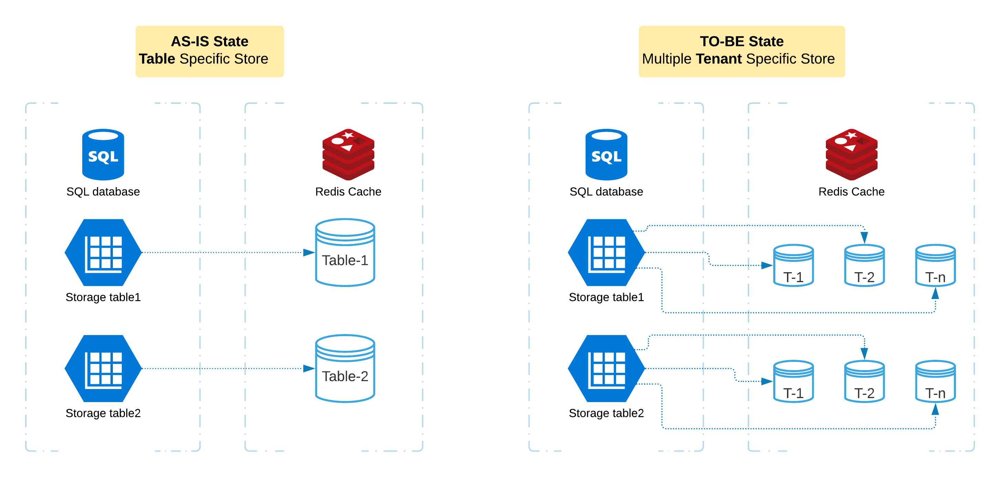

# Getting Started

###### Start Redis in Local System
> docker run --name local-redis -p 6379:6379 -d redis

###### To start the Application
- Provide PostgreSQL details in application.properties file
- Run below command
     - clean spring-boot:run
- Swagger URL
    - http://localhost:8080/vibes/demo/api/swagger-ui/index.html  

 

- API Spec
 
        ```yaml
        swagger: '2.0'
        info:
          description: Api Documentation
          version: '1.0'
          title: Api Documentation
          termsOfService: 'urn:tos'
          contact: {}
          license:
            name: Apache 2.0
            url: 'http://www.apache.org/licenses/LICENSE-2.0'
        host: 'localhost:8080'
        tags:
          - name: cache-controller
            description: Cache Controller
          - name: customer-controller
            description: Customer Controller
        paths:
          /vibes/demo/api/admin/caches:
            get:
              tags:
                - cache-controller
              summary: cacheNames
              operationId: cacheNamesUsingGET
              produces:
                - application/json
              responses:
                '200':
                  description: OK
                  schema:
                    type: array
                    items:
                      type: string
                '401':
                  description: Unauthorized
                '403':
                  description: Forbidden
                '404':
                  description: Not Found
          /vibes/demo/api/admin/caches/evict:
            delete:
              tags:
                - cache-controller
              summary: evictAll
              operationId: evictAllUsingDELETE
              produces:
                - application/json
              responses:
                '200':
                  description: OK
                '204':
                  description: No Content
                '401':
                  description: Unauthorized
                '403':
                  description: Forbidden
          /vibes/demo/api/tenant/customer:
            get:
              tags:
                - customer-controller
              summary: getCustomers
              operationId: getCustomersUsingGET
              produces:
                - application/json
              responses:
                '200':
                  description: OK
                  schema:
                    type: array
                    items:
                      $ref: '#/definitions/Customer'
                '401':
                  description: Unauthorized
                '403':
                  description: Forbidden
                '404':
                  description: Not Found
          /vibes/demo/api/tenant/customer/evict:
            delete:
              tags:
                - customer-controller
              summary: evictCaches
              operationId: evictCachesUsingDELETE
              produces:
                - application/json
              responses:
                '200':
                  description: OK
                '204':
                  description: No Content
                '401':
                  description: Unauthorized
                '403':
                  description: Forbidden
        definitions:
          Customer:
            type: object
            properties:
              id:
                type: string
              name:
                type: string
              tenant:
                type: string
            title: Customer
        
        ```


### Reference Documentation
For further reference, please consider the following sections:

* [Official Apache Maven documentation](https://maven.apache.org/guides/index.html)
* [Spring Boot Maven Plugin Reference Guide](https://docs.spring.io/spring-boot/docs/2.3.4.RELEASE/maven-plugin/reference/html/)
* [Create an OCI image](https://docs.spring.io/spring-boot/docs/2.3.4.RELEASE/maven-plugin/reference/html/#build-image)
* [Spring Web](https://docs.spring.io/spring-boot/docs/2.3.4.RELEASE/reference/htmlsingle/#boot-features-developing-web-applications)
* [Spring Data JPA](https://docs.spring.io/spring-boot/docs/2.3.4.RELEASE/reference/htmlsingle/#boot-features-jpa-and-spring-data)
* [Spring Data Redis (Access+Driver)](https://docs.spring.io/spring-boot/docs/2.3.4.RELEASE/reference/htmlsingle/#boot-features-redis)
* [Spring Data Reactive Redis](https://docs.spring.io/spring-boot/docs/2.3.4.RELEASE/reference/htmlsingle/#boot-features-redis)

### Guides
The following guides illustrate how to use some features concretely:

* [Building a RESTful Web Service](https://spring.io/guides/gs/rest-service/)
* [Serving Web Content with Spring MVC](https://spring.io/guides/gs/serving-web-content/)
* [Building REST services with Spring](https://spring.io/guides/tutorials/bookmarks/)
* [Accessing Data with JPA](https://spring.io/guides/gs/accessing-data-jpa/)
* [Messaging with Redis](https://spring.io/guides/gs/messaging-redis/)

